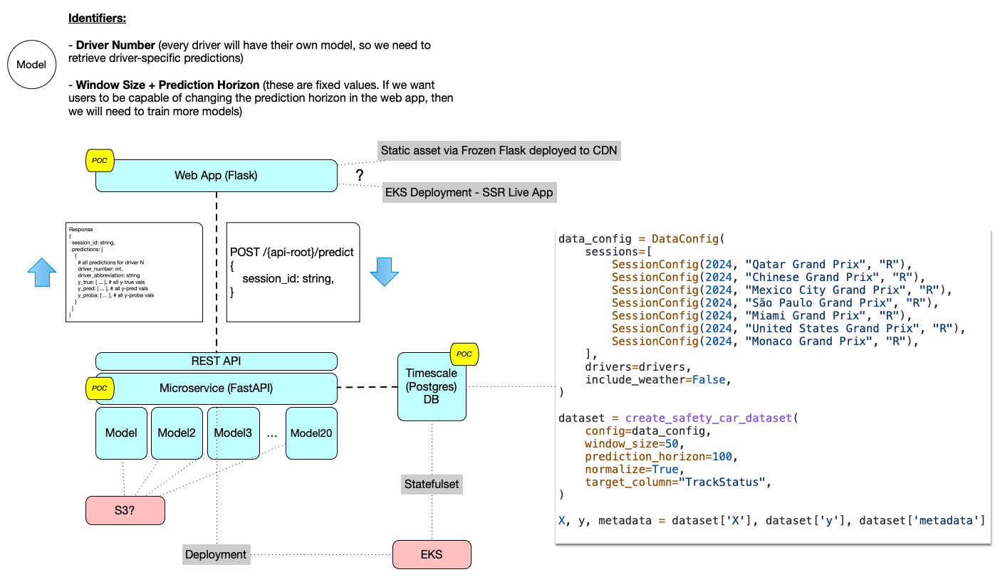
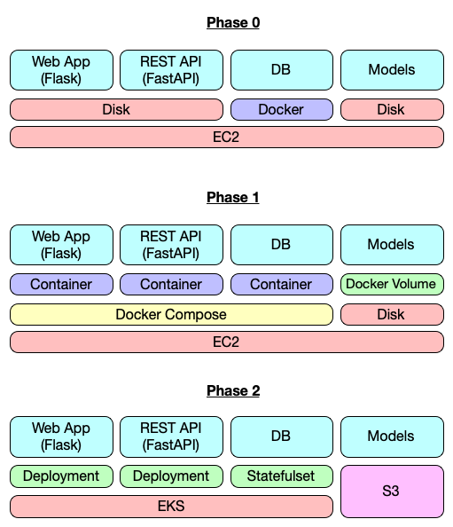

# Formula 1 Safety Car Prediction System - Technical Reference

## System Overview

This technical reference defines the architecture and interfaces for our Formula 1 Safety Car Prediction System. The system predicts the likelihood of safety car deployment during F1 races by analyzing real-time telemetry data from all drivers. Our application consists of three integrated components that work together to deliver predictions through a web-based dashboard.

The system processes time series data from Formula 1 sessions, where each time window represents a sequence of telemetry readings that our time series clf models use to predict safety car probability. Each driver has their own dedicated model, trained on historical race data with fixed window and prediction horizon parameters.



## Component Architecture

### Web Application (Owner: Justin)

The web application serves as the user-facing interface for our prediction system. Built with Flask, it provides a server-side rendered dashboard that visualizes both the current race state and our model's predictions in real-time.

The primary view consists of a Formula 1 race track visualization where driver positions are displayed as moving icons that update based on telemetry data. Alongside this track view, a bar chart displays the safety car probability for each driver, showing the model's confidence that a safety car will be deployed based on that driver's current situation. These probabilities are derived from the `y_proba` values returned by our prediction models - specifically, the probability of the positive class (safety car deployment).

The application operates as a read-only demonstration interface with no user controls for modifying parameters. This design choice reflects the fixed nature of our models, which are trained with specific window sizes and prediction horizons that cannot be adjusted at runtime. The frontend must handle session selection to allow users to view predictions for different races, which requires fetching available sessions from the API and presenting them in an appropriate interface element.

For deployment, we're considering two approaches: either generating static assets using Frozen Flask and hosting them on a CDN for optimal performance, or running the Flask application directly on a container platform like ECS or EKS. The choice will depend on whether we need dynamic server-side functionality beyond what can be pre-rendered.

### REST API Service (Owner: Thomas)

The REST API serves as the data and prediction layer of our system, built with FastAPI to provide high-performance endpoints for the web application. This service manages all 20 driver models in memory, eliminating model loading latency during prediction requests.

The API exposes three primary endpoints that the frontend consumes:

#### Get Available Sessions Endpoint

The sessions endpoint provides a discovery mechanism for the frontend to determine which F1 sessions are available for analysis:

```
GET /api/v1/sessions
```

This endpoint returns a comprehensive list of all sessions stored in our database, enriched with metadata that helps the frontend present meaningful choices to users. Each session entry includes:

- The unique session identifier following our naming convention (Year_Race Name_Session Type)
- The year and race name for display purposes
- The session type (FP1, FP2, FP3, Q for qualifying, or R for race)
- The session date for chronological ordering
- The number of drivers who participated (important for data completeness)
- The total count of time windows available for prediction

The response structure looks like this:

```json
{
  "sessions": [
    {
      "session_id": "2024_Saudi Arabian Grand Prix_R",
      "year": 2024,
      "race_name": "Saudi Arabian Grand Prix",
      "session_type": "R",
      "session_date": "2024-03-09T15:00:00Z",
      "driver_count": 20,
      "window_count": 2500
    }
  ]
}
```

#### Make Predictions Endpoint

The prediction endpoint is the core of our API, accepting a session identifier and returning predictions for all drivers across all time windows:

```
POST /api/v1/predict
Content-Type: application/json

{
  "session_id": "2024_Saudi Arabian Grand Prix_R"
}
```

The API retrieves all telemetry data for the specified session from the database, then processes it through each driver's model. The response includes three key arrays for each driver:

- `y_true`: The actual safety car status (0 or 1) for each time window, used for comparison
- `y_pred`: The model's predicted class (0 or 1) for each time window
- `y_proba`: The probability distribution as `[green_proba, red_proba, safety_car_proba, vsc_proba, vsc_ending_proba, yellow_proba]`

This design allows the frontend to display both the model's confidence (via probabilities) and its accuracy (by comparing predictions to ground truth).

#### Get Telemetry Endpoint

The telemetry endpoint provides positional data needed for the track visualization:

```
GET /api/v1/telemetry?session_id=2024_Saudi Arabian Grand Prix_R
```

This endpoint returns X, Y, and Z coordinates for each driver at each time window, enabling the frontend to animate driver movements on the track. The coordinates are extracted from the stored telemetry data and formatted for easy consumption by the visualization layer.

### Database & ETL Pipeline (Owner: Dylan)

The database component serves as the foundation for our time series data storage and retrieval. Using PostgreSQL with the TimescaleDB extension, it's optimized for time-series workloads while maintaining the flexibility of a relational database.

The ETL pipeline leverages our custom `f1-etl` tool to transform raw Formula 1 telemetry into properly formatted time series data. During initialization, the pipeline processes each session by:

1. Loading raw telemetry data for the session
2. Creating sliding windows with appropriate labels
3. Extracting metadata for each window (timestamps, driver information, etc.)
4. Storing the processed data in our database schema

The database schema centers around three main tables:

**time_series_windows** stores the actual time series data and predictions. Each row represents one time window for one driver, containing:
- The feature matrix as a JSONB field (N samples × 9 features)
- The target value indicating whether a safety car was deployed
- Temporal metadata including start time, end time, and prediction time
- Foreign keys linking to sessions and drivers

**sessions** maintains metadata about each F1 session, providing the context needed for the frontend to present meaningful options to users. This includes the race name, year, session type, and timing information.

**drivers** stores driver information including their number and three-letter abbreviation, ensuring consistent identification across the system.

The schema includes strategic indexes on session_id, driver_number, and temporal fields to optimize the query patterns we expect from the API. The use of JSONB for storing feature matrices provides flexibility while maintaining query performance through PostgreSQL's native JSON indexing capabilities.

## Integration Contracts

The success of our system depends on well-defined contracts between components:

### Frontend-API Integration

The frontend must implement a session selection workflow that:
1. Calls the `/sessions` endpoint on initial load
2. Presents available sessions to the user (consider grouping by year or race)
3. Triggers prediction and telemetry requests when a session is selected
4. Handles loading states appropriately while data is being fetched
5. Gracefully manages error scenarios with user-friendly messages

### API-Database Integration

The API must efficiently query large datasets by:
1. Using prepared statements to prevent SQL injection
2. Implementing query result streaming for large telemetry datasets
3. Leveraging database indexes through appropriate WHERE clauses
4. Considering connection pooling with appropriate pool sizes

### Data Format Specifications

All components must agree on data formats:
- Timestamps (ISO 8601???) format with timezone information
- Feature matrices are stored as nested arrays: `[[sample1_features], [sample2_features], ...]`
- Driver numbers are integers (1-99), abbreviations are uppercase 3-letter codes
- Session IDs follow the pattern: `{YEAR}_{Race Name}_{Session Type}`

## Deployment Strategy: Three-Phase Migration

Our deployment strategy follows a three-phase approach that begins with the simplest possible architecture and progressively adds containerization and orchestration capabilities. This graduated strategy allows us to validate our application logic and data flows before introducing infrastructure complexity, reducing the risk of conflating application issues with deployment challenges.



### Phase 0: Proof of Concept

The initial phase serves as our proof of concept, where we validate the core functionality of our prediction system with minimal infrastructure overhead. This phase combines traditional application deployment with containerized database management, providing a pragmatic balance between simplicity and operational consistency.

In this architecture, both the Flask web application and FastAPI REST service run directly on an EC2 instance without containerization. This approach offers several immediate benefits during early development: developers can modify code and see changes without rebuilding containers, debugging becomes straightforward with direct access to application logs and processes, and we can rapidly iterate on features without managing Docker layers or build times.

The PostgreSQL database with TimescaleDB, however, runs as a Docker container even in this initial phase. This decision reflects the complexity of installing and configuring TimescaleDB extensions on a host system, as well as the benefit of having a consistent database environment from the very beginning. By containerizing only the database, we achieve a balance where the stateful component that's most sensitive to configuration differences is isolated, while keeping our application layer accessible for rapid development.

Model storage in Phase 0 uses the simplest possible approach: files on the local filesystem. The API service loads all models into memory at startup, reading from a dedicated model directory path configured via environment variable. 

### Phase 1: Docker Compose on EC2

In our initial deployment phase, we'll containerize each component and orchestrate them using Docker Compose on an EC2 instance. This approach provides a straightforward path to deployment while maintaining the isolation benefits of containerization.

Phase 1 consists of a single EC2 instance running Docker Engine with our three containers orchestrated via Docker Compose. The web application container will expose port 5000 (or configured port) to serve the Flask application, while the REST API container exposes port 8000 for FastAPI. The PostgreSQL container uses the standard port 5432 with the TimescaleDB extension pre-installed.

Our models will be stored on the EC2 instance's filesystem and mounted into the API container via a bind mount.

The database will utilize a named Docker volume for data persistence, ensuring that our time series data survives container restarts.

For networking, all three containers will communicate over a Docker bridge network, allowing them to reference each other by service name rather than IP addresses. The only exposed ports to the host will be the web application port for user access.

### Phase 2: Kubernetes Migration

Once we've validated our system's functionality and performance characteristics in Phase 1, we'll migrate to Kubernetes.

Our web application and REST API will run as separate Deployments, each with configurable replica counts for horizontal scaling. The web app Deployment will include a Service of type LoadBalancer (or NodePort behind an Ingress) to handle external traffic, while the API Deployment uses a ClusterIP Service for internal communication. This separation allows us to scale each tier independently based on load patterns.

The PostgreSQL database will deploy as a StatefulSet with a single replica. The StatefulSet will use a PersistentVolumeClaim to request storage from the cluster's storage class, providing data persistence across pod restarts.

Model storage in Kubernetes requires careful consideration. We have two primary options, each with trade-offs:

**Option 1: Kubernetes Volumes** - Models are stored in a PersistentVolume and mounted into API pods. This approach maintains similarity to our Phase 1 architecture but requires careful volume access mode configuration if we run multiple API replicas. ReadOnlyMany access mode would allow all pods to share the same model files.

**Option 2: S3 Integration** - Models are stored in S3 and loaded by the API service at startup. This approach provides better scalability and model versioning capabilities but requires modifying our API code to download models from S3 on initialization. We'd implement caching to avoid repeated downloads and could use S3 versioning for model rollback capabilities.